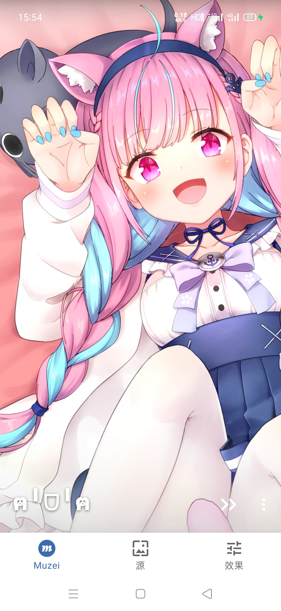
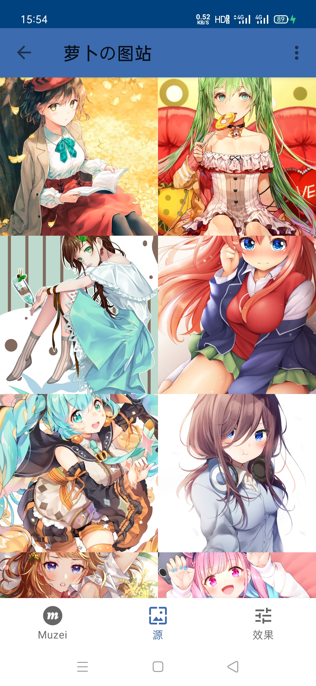
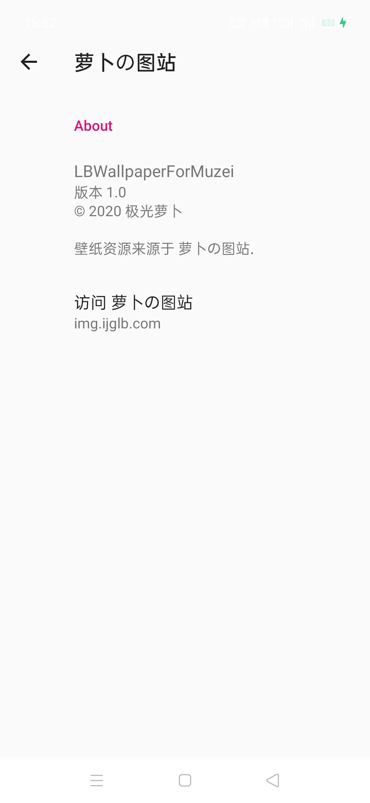
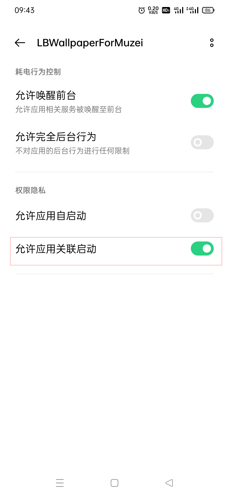

# LBWallpaper For Muzei
[萝卜の图站](https://img.ijglb.com/) 随机手机壁纸 For [Muzei](https://muzei.co/)

# 屏幕截图

   
   
   

# 下载
Release：[https://github.com/ijglb/LBWallpaperForMuzei/releases](https://github.com/ijglb/LBWallpaperForMuzei/releases)

# 允许后台
如果在使用时发现每次一开始可以正常获取壁纸，但过一会就不行了（表现为在Muzei中点击下一张时画面一直在Loading无法正常加载/使用Muzei的定时切换壁纸功能，但一直不会自动切换）。说明手机有耗电管理或其他限制之类的东西限制了本应用被Muzei后台调用的权限。请根据自己手机的情况将本应用的相关权限设置为允许。
例如：OPPO ColorOS11系统需将本应用的“允许应用关联启动”打开，在应用管理中找到本应用，点击“耗电管理”，将“允许应用关联启动”打开

   

